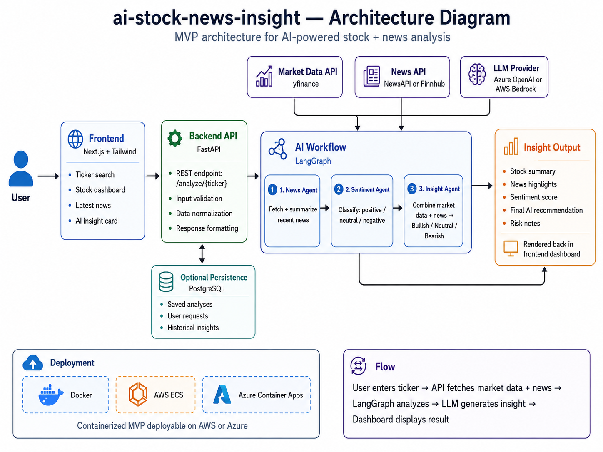

# AI Stock News Insight

AI-powered stock and financial news analysis platform built with LangGraph, FastAPI, Next.js and cloud-native architecture principles.

---

# Overview

AI Stock News Insight is a lightweight enterprise-style MVP designed to analyze stock market trends by combining:

- real-time market data,
- financial news,
- AI-driven sentiment analysis,
- and LLM-generated investment insights.

The platform demonstrates how modern AI workflows can support financial decision-making using multi-step orchestration and cloud-ready architecture.

The project is intentionally designed as a realistic AI engineering portfolio project, combining:
- AI orchestration,
- financial data analysis,
- cloud deployment patterns,
- modern frontend engineering,
- and enterprise architecture concepts.

---

# Architecture



The system follows a modular architecture:

```text
Frontend (Next.js)
        ↓
FastAPI Backend
        ↓
LangGraph Workflow
        ↓
Market Data + News + LLM Providers
```

The AI workflow combines:
1. News retrieval,
2. Sentiment analysis,
3. AI insight generation.

---

# Why Next.js and Tailwind?

The frontend uses:
- **Next.js** for scalable React-based application architecture,
- **Tailwind CSS** for fast and consistent UI development.

This combination provides:
- production-style frontend structure,
- responsive dashboard interfaces,
- cloud-friendly deployment,
- clean developer experience,
- and modern enterprise UI patterns.

The goal is not only functionality, but also demonstrating realistic software architecture practices.

---

# Why FastAPI?

FastAPI is used because it is lightweight, performant and integrates naturally with:
- Python AI ecosystems,
- LangGraph,
- financial data processing,
- and LLM orchestration workflows.

It also allows easy containerization and deployment to AWS or Azure.

---

# Why LangGraph?

LangGraph is used to orchestrate the AI workflow.

Instead of a single monolithic prompt, the system separates responsibilities into lightweight AI agents:

- News Agent
- Sentiment Agent
- Insight Agent

This provides:
- modularity,
- workflow visibility,
- scalability,
- and more realistic enterprise AI patterns.

---

# Why yfinance?

`yfinance` is a Python package used to retrieve stock market data from Yahoo Finance.

The "y" stands for:

> Yahoo Finance

For the MVP, yfinance provides:
- historical stock prices,
- market metadata,
- basic financial indicators,
- and rapid prototyping capabilities.

The architecture intentionally allows replacing yfinance with enterprise-grade market providers such as:
- Polygon,
- Finnhub,
- Bloomberg,
- or Refinitiv APIs.

---

# Features

- Stock ticker search
- Financial news retrieval
- AI-generated market summaries
- Sentiment classification
- Bullish / Neutral / Bearish insights
- Cloud-ready architecture
- Docker deployment
- Modular AI workflow design

---

# Tech Stack

## Frontend
- Next.js
- React
- Tailwind CSS
- TypeScript

## Backend
- FastAPI
- Python
- LangGraph
- LangChain

## AI
- Azure OpenAI / OpenAI API
- Prompt orchestration
- AI workflow pipelines

## Data Sources
- yfinance
- NewsAPI / Finnhub

## Infrastructure
- Docker
- AWS ECS
- Azure Container Apps

---

# Project Structure

```text
ai-stock-news-insight/
│
├── README.md
├── LICENSE
├── .gitignore
├── docker-compose.yml
│
├── architecture/
│   └── architecture-diagram.png
│
├── frontend/
│   ├── package.json
│   ├── next.config.js
│   ├── tailwind.config.ts
│   ├── tsconfig.json
│   │
│   ├── app/
│   │   ├── page.tsx
│   │   ├── layout.tsx
│   │   └── dashboard/
│   │       └── page.tsx
│   │
│   ├── components/
│   │   ├── ticker-search.tsx
│   │   ├── stock-card.tsx
│   │   ├── news-list.tsx
│   │   └── ai-insight-card.tsx
│   │
│   ├── lib/
│   │   └── api.ts
│   │
│   └── public/
│
├── backend/
│   ├── requirements.txt
│   ├── Dockerfile
│   │
│   ├── app/
│   │   ├── main.py
│   │   ├── config.py
│   │   │
│   │   ├── api/
│   │   │   └── routes.py
│   │   │
│   │   ├── agents/
│   │   │   ├── news_agent.py
│   │   │   ├── sentiment_agent.py
│   │   │   └── insight_agent.py
│   │   │
│   │   ├── services/
│   │   │   ├── market_service.py
│   │   │   ├── news_service.py
│   │   │   └── llm_service.py
│   │   │
│   │   ├── workflows/
│   │   │   └── stock_workflow.py
│   │   │
│   │   ├── models/
│   │   │   └── schemas.py
│   │   │
│   │   └── utils/
│   │       └── helpers.py
│   │
│   └── tests/
│
├── infra/
│   ├── docker/
│   ├── aws/
│   └── azure/
│
├── docs/
│   ├── architecture.md
│   ├── deployment.md
│   ├── ai-workflow.md
│   └── roadmap.md
│
└── screenshots/
```

---

# Deployment

The project is containerized and designed to run on:
- AWS ECS,
- Azure Container Apps,
- or local Docker environments.

---

# Roadmap

## MVP
- Stock lookup
- News ingestion
- Sentiment analysis
- AI insight generation

## Future Improvements
- Real-time streaming
- Portfolio analysis
- Vector database memory
- RAG for SEC filings
- Multi-agent collaboration
- Advanced technical indicators
- Human-in-the-loop review
- Observability and tracing

---

# Purpose

This repository is designed as:
- an AI engineering portfolio project,
- a cloud-native architecture showcase,
- and a demonstration of enterprise AI workflow design.

It combines practical AI implementation with modern software engineering and scalable deployment concepts.
